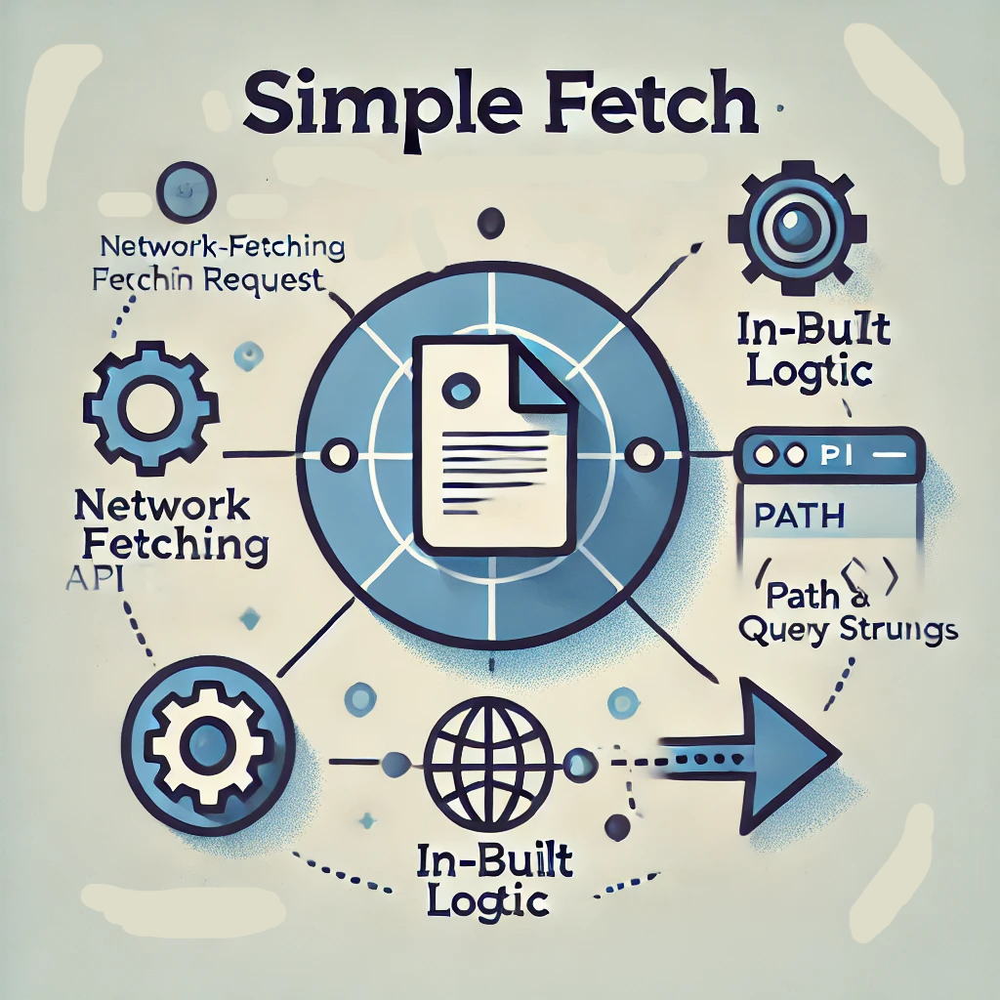

# Simple Fetch



<br />

**Simple Fetch** is an object-first NPM package that simplifies network data fetching. It wraps the JavaScript Fetch API with additional functionalities to make your code more efficient and readable.

---

## Features

- **Object-First Data Fetching**: Pass data directly as objects, improving code clarity.
- **In-Built Base Request Logic**: Automatically handles responses based on content type.
- **Encoded Path and Query Parameters**: Simplifies URL construction by encoding path and query data.
- **Customizable Settings**: Set timeouts and parameter delimiters for your specific needs.

---

## Installation

Install the package using npm or yarn:

```bash
npm install simple-fetch

# or

yarn add simple-fetch
```

## How To Use

### Basic request

```javascript
import fetcher from "simple-fetch";
```

### Mutation request (POST, PUT, PATCH and DELETE)

## Configuration

When initializing `SimpleFetch`, you can pass the following options:

### Base options

| Option          | Type                                   | Description                                                |
| --------------- | -------------------------------------- | ---------------------------------------------------------- |
| `baseUrl`       | `String`                               | Base URL for all requests.                                 |
| `path`          | `string \| string[] \| undefined`      | URL path segments.                                         |
| `query`         | `string \| string[] \| undefined`      | URL query parameters.                                      |
| `method`        | `string`                               | Request action method.                                     |
| `body`          | `string \| undefined`                  | Request payload.                                           |
| `credentials`   | `"same-origin" \| "omit" \| "include"` | Request credentials.                                       |
| `keepalive`     | `boolean`                              | Persist requests request connection.                       |
| `mode`          | `"same-origin" \| "cors" \| "no-cors"` | Request CORS mode.                                         |
| `customOptions` | `CustomOptionsType`                    | Request options not explicitly available in the Fetch API. |

### Custom options

| Option                      | Type                                                                  | Description                                        |
| --------------------------- | --------------------------------------------------------------------- | -------------------------------------------------- |
| `responseType`              | `"text" \| "json" \| "formData" \| "blob" \| "arrayBuffer" \| "body"` | Request response type. Default is `json`.          |
| `timeout`                   | `number`                                                              | Time as milliseconds before terminating request.   |
| `queryParamsArrayFormatter` | `"brackets" \| "comma" \| "repeat" \| "none"`                         | Indicates how parameter array should be formatted. |

Example:

```javascript

// Set request timeout and response type
const options = {
    responseType: 'text',
    timeout: 5000, // 5 seconds
    queryParamsArrayFormatter: "brackets"
}

const fetch await fetcher({
    url: "https://jsonplaceholder.typicode.com/posts",
    ...,
    ...,
    customOptions: options
})
```

## License

This project is licensed under the MIT License... I think!
